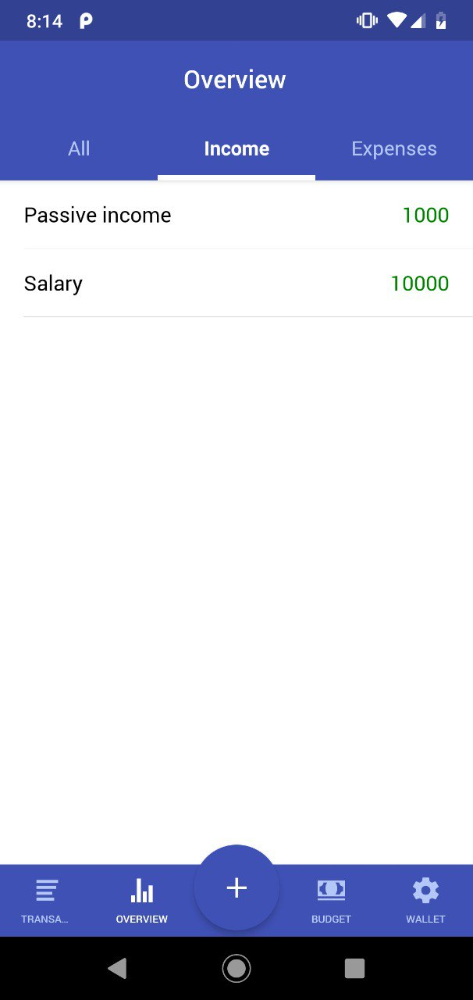
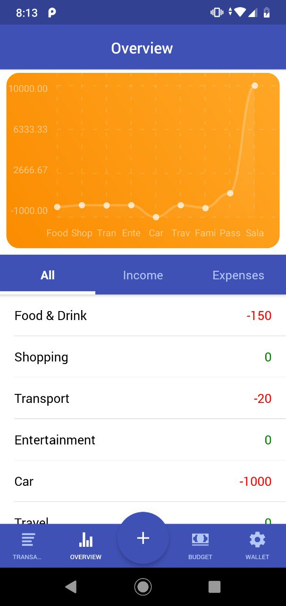
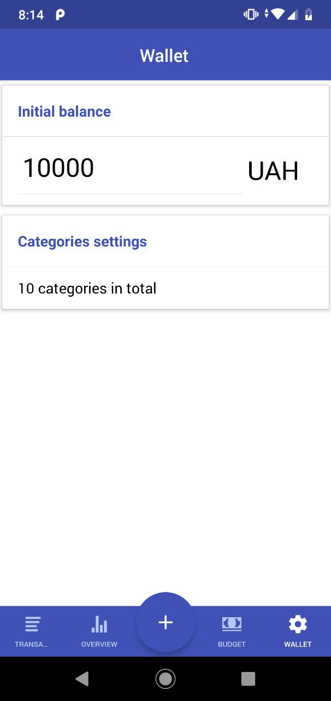
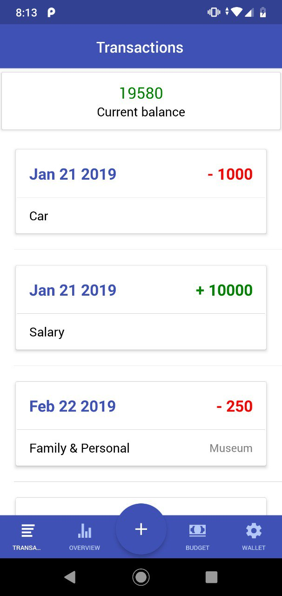
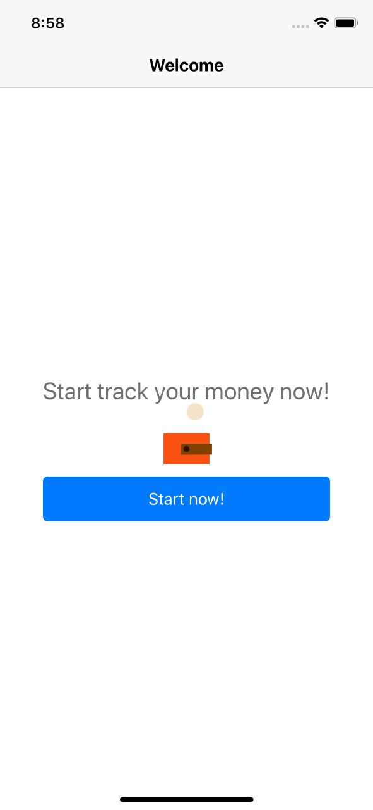
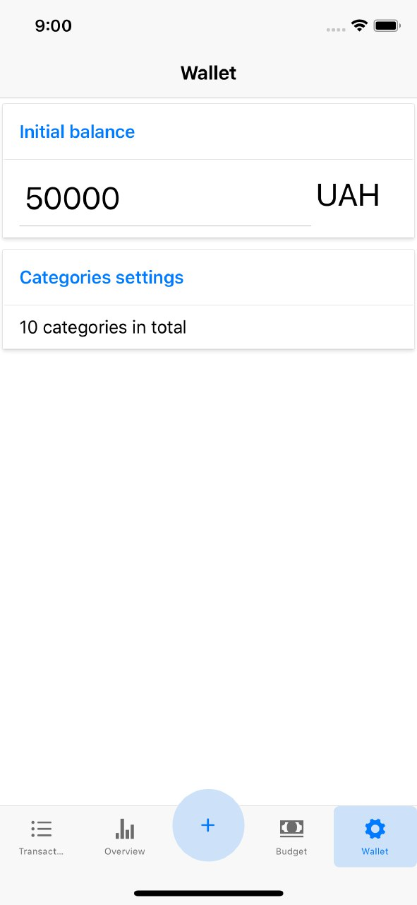
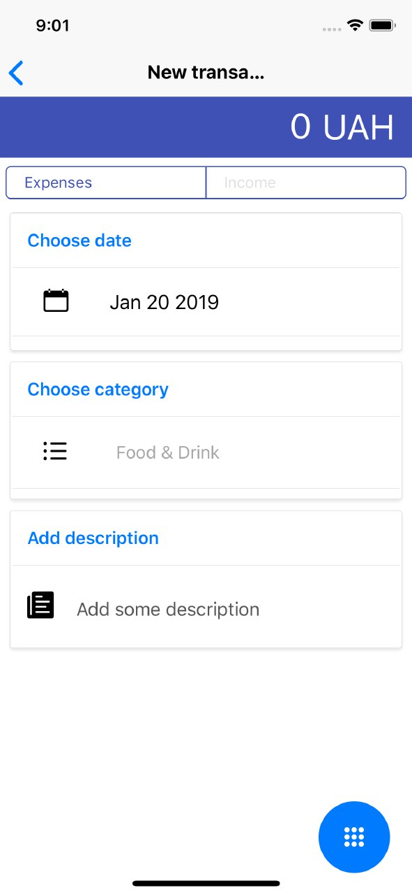
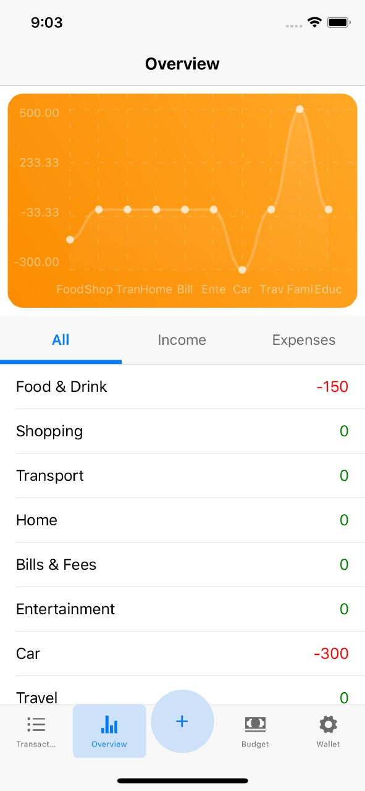

# myMoney 💸
### myMoney is an application for calculating income and expenses.

#### Functionality:

1. Add/delete/edit your income and expenses

2. Add/delete/edit expense and income categories

3. View income and expenses for each category + data are presented in a convenient chart.

4. All data is saved and not lost after application restart.

## Android

## IOS

 

## How to launch ?

1. Be sure that you installed react-native-cli following these recomendations: https://facebook.github.io/react-native/docs/getting-started

2. <i>git clone https://github.com/vtolochk/myMoney.git</i>

3. <i>cd myMoney</i>

4. Type <i>yarn</i> or <i>npm</i> for installing node modules

5. <b>ANDROID</b> - react-native run-android

6. <b>IOS</b> - react-native run-ios

 <i>Notion: This app was built in Xcode 9.2 cause of my technical limitations. So before run it on IOS try to build it in your Xcode. I didn't have an opportunity to test it on new Xcode so it could be some buggy on IOS.</i>

 ## Dependencies

1. React/React Native - as a basis

2. Redux - as a store manager

3. Redux-persist - as a AsyncStorage

4. React-router-native - as a navigation

5. React-native-chart-kit - as a chart

6. Lottie-react-native - as an executor for lottie animations

### Additional Information
  This app was built in six days cause of my workload. I would like to make it better and add some tests, animations and flow in the future.
